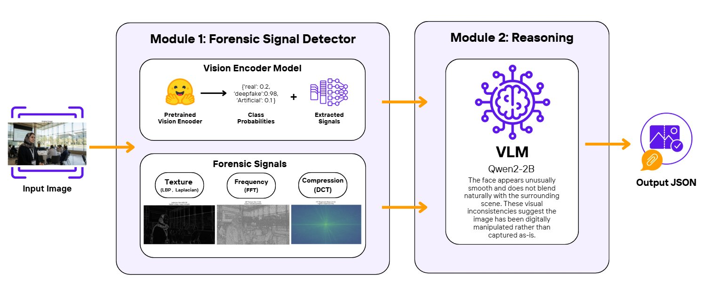

# DEFAKE - Deepfake Detection with VLM Reasoning

Detects AI-generated images and deepfakes using a hybrid approach: backbone classifier + forensic signals + vision-language model explanations.

**Team**: Yara Alzahrani, Shouq Alhatem, Manar Ali (KAUST)

## Architecture



The system uses two modules:
- **Module 1**: Forensic Signal Detector (vision encoder + texture/frequency/compression analysis)
- **Module 2**: VLM Reasoning (Qwen2-2B explains why image is manipulated)

## Installation

```bash
pip install -r requirements.txt
```

## Usage

```bash
python predict.py --input_dir ./images --output_file results.json
```

## How It Works

1. **Backbone Classifier** classifies image as Artificial/Deepfake/Real
2. **If Real** → Skip VLM (fast)
3. **If Not Real** → Extract forensic signals (Laplacian, LBP, FFT, DCT) → VLM explains why

## Output

```json
{
  "image_name": "photo.jpg",
  "manipulation_type": "Deepfake",
  "authenticity_score": 0.85,
  "explanation": "The face appears unusually smooth..."
}
```

## Performance

- AUC: 0.70 (binary classification)
- Speed: ~45ms (Real), ~230ms (Non-Real)

## Requirements

- Python 3.8+
- GPU with 8GB VRAM recommended
- First run downloads ~4GB of models

## License

MIT
